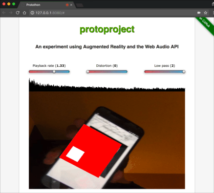

# Protothon

Live Demo: [https://umaar.github.io/protoproject](https://umaar.github.io/protoproject/index.html)

Access the ARCode markers: [https://umaar.github.io/protoproject/markers.html](https://umaar.github.io/protoproject/markers.html)

This project uses WebRTC API's to enable control of Audio filters using ARCodes. Hit _Play Audio_ and then load up
the markers using your mobile device. Based on the rotation angle of the ARCode, the audio filter settings will be adjusted.

## Quick Preview:

_💡 Notice the playback rate_

